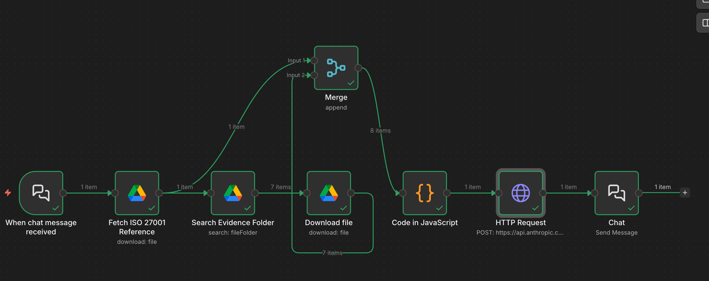
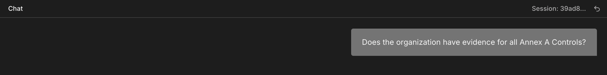
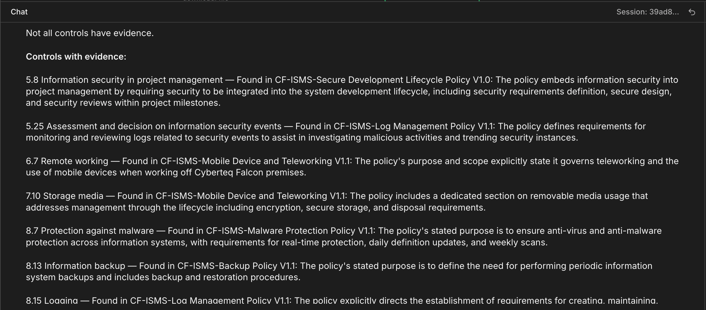
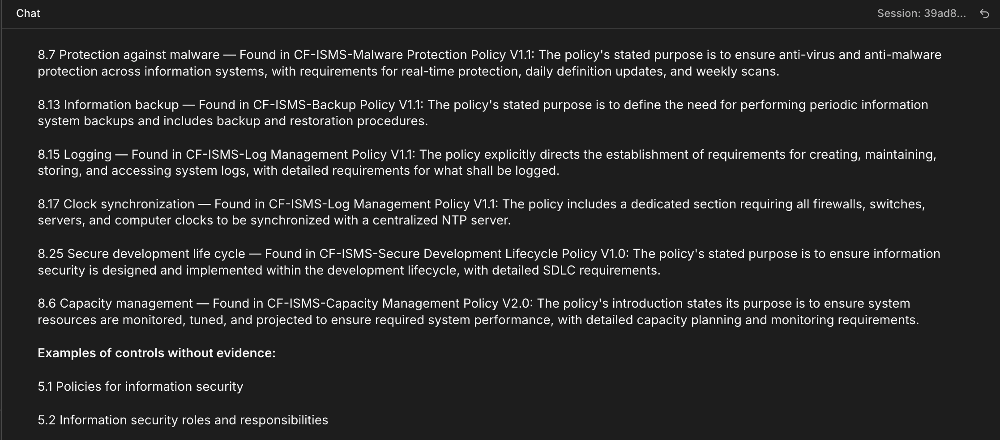
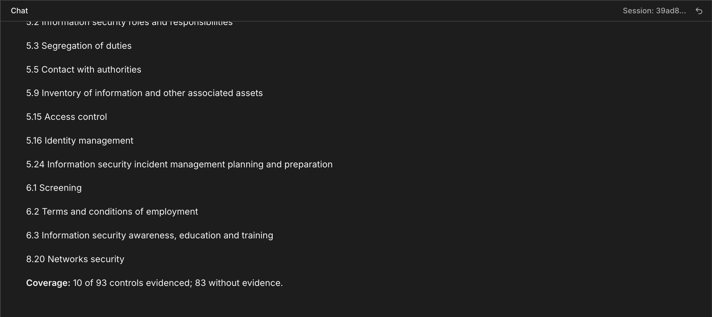

# isms-document-search-agent-poc
A self-hosted n8n and Claude RAG pipeline that automates the search for ISO 27001 documents during gap assessments and auditing


## 1. What This Is

This project is a Proof of Concept (PoC) for a tool that automates the search for ISMS documents. By connecting an automated orchestration pipeline to organizational ISMS files, it acts as an intelligent assistant that verifies whether required security controls are documented/evidenced. It provides GRC and information security professionals with structured security control substantiation & evidence verification without manual folder skimming.


## 2. Demo

▶️ [**Click here to watch the full 93-control scan execution demo**](https://youtu.be/seO02_JWWog)

Note: The video demonstrates a full 93-ISO-control scan. The entire automated sequence finishes in ~75 seconds and is at least an order-of-magnitude reduction in time compared to manual auditing.

## 3. How It Works
The workflow operates as a deterministic sequence of eight nodes that run after a user's query:



* **When chat message received:** A built-in n8n Chat Trigger captures the user's query from the interface. It uses "Using Response Nodes" mode to defer the final response to the end of the pipeline. An example is captured below:
  


* **Fetch ISO 27001 Reference:** A Google Drive Download node that pulls the core ISO 27001:2022 standard text from a designated Reference folder. It exports it as plain text (`.txt`) via Google File Conversion and then stores the binary data in a named field (`isoData`).
* **Search Evidence Folder:** A Google Drive Search node that queries the target operational folder using advanced parameters (`[folder ID] in parents and trashed = false`) to identify all compliance evidence files.
* **Download file:** A Google Drive Download node that loops through the identified evidence file IDs and downloads each sequentially as plain text. 
* **Merge (Append):** A structural node that merges the single ISO reference document (Input 1) and the multiple downloaded evidence files into a combined stream of 8 items. 
* **Code in JavaScript:** A Code node that extracts the binary text of all 8 items using n8n's `getBinaryDataBuffer` helper. It decodes the bytes into UTF-8 text and structures them into a single comprehensive string variable (`combinedDocuments`) whilst cleanly separating and labeling each document by its filename.
* **HTTP Request:** A POST request that sends the payload directly to the Anthropic API endpoint (`https://api.anthropic.com/v1/messages`). The request contains the model parameter, the system prompt, and the payload containing `combinedDocuments` along with the user's original query.
The node utilizes a deterministic system prompt to enforce strict output formatting, neutralize conversational filler, and eliminate speculative hallucinations.The prompt is as below:

```
You are a specialized ISO 27001 Audit Assistant.

ROLE
Verify whether ISO 27001 Annex A security controls are evidenced within the documents provided to you.

REFERENCE
Use the provided ISO 27001:2022 Annex A as the sole definition of every control. Each control in Annex A has a concise definition stating what shall exist. Match the user's query against that definition only. Never use general training knowledge to interpret any control.

EVIDENCE STANDARD
A document evidences a control ONLY if the document explicitly states in its title, purpose, scope, or objective section that it is about that control's subject matter. The declaration must be direct and unambiguous.

The test is simple: does the document say, in its own words, that it exists to address this subject? If yes, it counts. If not, it does not, regardless of how many times related concepts appear in the body.

What counts:
- A document titled 'Backup Policy' whose purpose section states it governs backup and restoration procedures evidences the backup control.
- A document titled 'Malware Protection Policy' whose scope states it covers anti-malware requirements evidences the malware control.

What does not count:
- A document that mentions a concept in passing, as a method, or as a step within a different procedure.
- A document whose title and purpose are about a different subject, even if related concepts appear throughout.
- A document that addresses a control's subject matter as a secondary or incidental concern.

If the document does not explicitly declare in its title, purpose, scope, or objective that it covers the control's subject, report: 'No evidence found for [Control Name/Number].'

THREE QUESTION TYPES

A) SINGLE CONTROL ('Is there evidence for control X?')
Respond using ONLY one of these:
- Dedicated file exists: 'Yes, a dedicated file exists: [Filename].'
- Control is a section within a file: 'Found in [Filename]: [2-3 sentence summary of the section whose primary subject matches this control].'
- No evidence: 'No evidence found for [Control Name/Number].'

B) A GROUP, SUBSET, OR LIST OF CONTROLS
This includes any of: a formal category ('physical controls', 'people controls'), a numeric range ('controls 8.1-8.10'), OR a free-form list of control topics/themes named by the user (e.g. 'termination, screening of employees, working from home').

First, map each topic the user named to its corresponding ISO 27001 Annex A control using the reference document. Then apply the evidence standard above to each. For each named topic that HAS evidence, give one entry:
[Control Number] [Control Name] — Found in [Filename]: [1-2 sentence summary].

For any named topic with no evidence, add one line: 'No evidence found for [topic].'
Cover every topic the user listed. Do not elaborate beyond this.

C) ALL CONTROLS ('Is there evidence for all controls?')
Apply the evidence standard above to every control before reporting it as evidenced. Respond in this exact structure:
Line 1: 'Not all controls have evidence.'
Then: 'Controls with evidence:'
List one line per evidenced control: [Control Number] [Control Name] — Found in [Filename]: [1 sentence summary].
Then: 'Examples of controls without evidence:' followed by a short list (8-12) of notable unevidenced controls, formatted: [Control Number] [Control Name].
Then a final coverage line: 'Coverage: [X] of 93 controls evidenced; [93 minus X] without evidence.'

Do not add compliance commentary or closing remarks beyond this structure.

GUARDRAILS
- Only report what is explicitly found in the provided documents. Never invent or assume.
- A document must explicitly declare in its title, purpose, scope, or objective that it covers the control's subject. Incidental mentions do not qualify.
- Cite the exact filename for every finding.
- No general security advice or recommendations.
- If uncertain whether the evidence standard is met, always default to 'No evidence found.'
- Separate each control finding with a blank line. Never run findings together in a single paragraph block.
```

* **Chat (Send Message):** It extracts the raw text response from Claude's response path (`content[0].text`) and renders it cleanly back to the chat UI, as seen below:
---





This pipeline operates on Retrieval-Augmented Generation (RAG) principles thus grounding model outputs in verifed source documentation.

### Tech Stack
* **Orchestration Engine:** n8n (Self-hosted)
* **LLM Core:** Anthropic API (Claude 3.5 Sonnet / Claude 4.5)
* **Storage & Document Retrieval:** Google Drive API 
* **Data Processing:** JavaScript (ECMAScript 6 within n8n Code node environment)
* **Protocol Layer:** HTTPS 

## 5. Limitations and Next Steps
While effective for localized operations, this proof-of-concept pipeline scales under the following functional constraints: 
* It passes full policy texts directly into the prompt context thus creating scaling bottlenecks as the document library grows
* Its self-hosted architecture lacks the enterprise authorization boundaries required for secure and multi-department compliance operations. 

### Data Sovereignty and Flow
For this proof of concept, running n8n locally alongside a personal drive and the Anthropic API under its commercial terms provides a controlled and effectively “sovereign” data path. However, for production-scale deployment, a preferred approach would be to build or integrate the solution using Microsoft-native services, for document storage (and vector database functionalities) especially, to ensure enterprise-grade compliance and sovereign data tenancy. Future iterations will pivot towards a vectorized database with compliant data tenancy as well as prompt caching and a query/response interface accessible to all team members.


